# Smart Expense Tracker 📈

A smart personal finance dashboard that automatically fetches your **Gmail transaction emails**, parses the data using NLP and logic, stores them in a secure database, and shows clean **visual insights** of your spending habits.

---

## 🚀 Features

* Google OAuth login for secure Gmail access
* Reads UPI, GPay, card & bill transaction emails
* Categorizes transactions by keywords (Zomato → Food, Amazon → Shopping)
* Stores data per-user in SQLite DB
* Shows:

  * Daily spend trend
  * Spend by category
  * Top merchants
  * No. of transactions per category
* Downloadable CSV
* Clean UI + Auto caching to avoid Gmail re-fetch

---

## 🔄 Project Flow (Login → Gmail Fetch → DB → Dashboard)

```mermaid
graph TD
    A[Open App] --> B[Login with Google]
    B --> C[OAuth: Gmail Readonly Access]
    C --> D[Check Local DB for Transactions]
    D -- Not Found --> E[Fetch Emails from Gmail API]
    E --> F[Parse Email ✉️: Amount, Merchant, Category]
    F --> G[Store into SQLite DB + Save CSV]
    D -- Found --> H[Load from DB]
    G --> I[Show Dashboard]
    H --> I
```



---

## 🔧 Tech Stack

* Python
* Streamlit
* SQLite3
* Google OAuth (via `google-auth-oauthlib`)
* Gmail API (Readonly scope)
* NLP using RegEx + Logic
* Matplotlib & Seaborn for visualization

---

## 📆 Screenshots & Steps

> ### 1. Open the Smart Expense Tracker app


> ### 2. Prompt to login with Gmail


> ### 3. Click login to begin OAuth


> ### 4. Grant permission to read Gmail


> ### 5. Copy the full url


> ### 6. paste into the box


> ### 7. click on Submit Code button


> ### 8 & 9. Select date range to fetch transactions


> ### 10. fetch transactions(Checking local DB or Gmail API)


> ### 11. Dashboard with totals, Daily Spend Trend (line chart) & Spend by Category (pie chart)


> ### 12. Top Merchants & Transaction Counts by Category


> ### 13. Expand to see full table & Download CSV


---

## 🖋️ How to Run Locally

### 1. Clone the repo

```bash
git clone https://github.com/Akash-Sare03/smart-expense-tracker.git
cd smart-expense-tracker
```

### 2. Create and activate virtual environment

```bash
python -m venv venv
source venv/bin/activate  # or venv\Scripts\activate on Windows
```

### 3. Install requirements

```bash
pip install -r requirements.txt
```

### 4. Set up your own Gmail OAuth credentials

* Go to [Google Cloud Console](https://console.cloud.google.com/)
* Create a new project
* Enable Gmail API
* Create OAuth credentials (Web/Desktop)
* Add redirect URIs like `http://localhost:8501` and `http://localhost:8080`
* Download `credentials.json`

### 5. Add your credentials to `.streamlit/secrets.toml`

```toml
[gcp]
client_config = """
{...your downloaded JSON...}
"""
```

### 6. Run the app

```bash
streamlit run main_app.py
```

---

## 🔍 Future Enhancements

* Add monthly summary PDF
* Add alerts for overspending
* Use PostgreSQL or cloud DB
* OTP/email confirmation for users
* Mobile-friendly responsive UI

---

## 📊 Live Demo

> 🔗 [https://smart-expense-tracker-8sugdqlzf2rp2f5mkpt5tl.streamlit.app/](https://smart-expense-tracker-8sugdqlzf2rp2f5mkpt5tl.streamlit.app/)

Use your own Gmail to test. App is fully private and secure.

---

## ✅ Author

Made with ❤️ by [Akash Sare](https://github.com/Akash-Sare03)

---

## ⚠️ Disclaimer

> This app only reads Gmail content with your permission. No data is stored externally.

---
